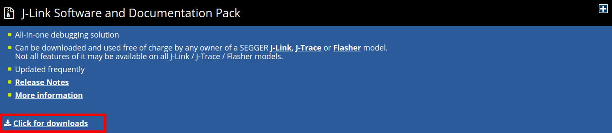
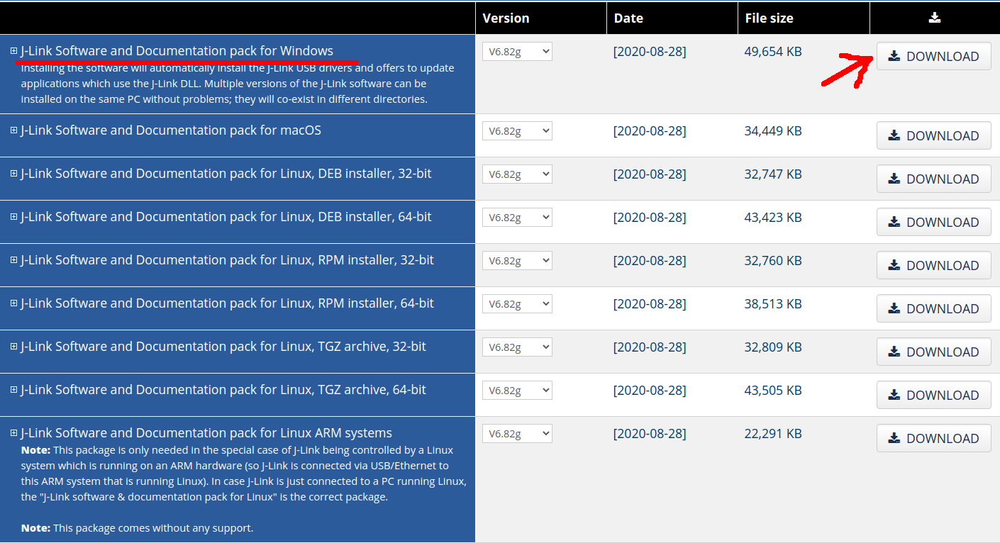
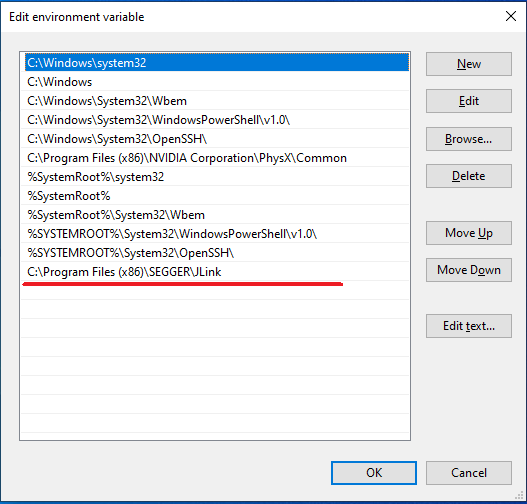

# 1- Instalação do SEGGER JLink

## 1.1- Linux

### 1.1.1- Instalar via apt:

```bash
$ sudo apt install jlink

# Reload udev
$ sudo udevadm control --reload-rules && udevadm trigger
```

### 1.1.2- Conectar o kit de desenvolvimento ao USB e testar a conexão:

```bash
# Executar o comando abaixo no bash
$ JLinkGDBServer -if SWD -device nRF52832_xxAA

# O texto abaixo deve aparecer como resultado
SEGGER J-Link GDB Server V6.82g Command Line Version

JLinkARM.dll V6.82g (DLL compiled Aug 28 2020 17:58:15)

Command line: -if SWD -device nRF52832_xxAA
-----GDB Server start settings-----
GDBInit file:                  none
GDB Server Listening port:     2331
SWO raw output listening port: 2332
Terminal I/O port:             2333
Accept remote connection:      yes
Generate logfile:              off
Verify download:               off
Init regs on start:            off
Silent mode:                   off
Single run mode:               off
Target connection timeout:     0 ms
------J-Link related settings------
J-Link Host interface:         USB
J-Link script:                 none
J-Link settings file:          none
------Target related settings------
Target device:                 nRF52832_xxAA
Target interface:              SWD
Target interface speed:        4000kHz
Target endian:                 little

Connecting to J-Link...
J-Link is connected.
Firmware: J-Link OB-SAM3U128-V2-NordicSemi compiled Mar 17 2020 14:43:00
Hardware: V1.00
S/N: 682302653
Feature(s): RDI, FlashBP, FlashDL, JFlash, GDB
Checking target voltage...
Target voltage: 3.30 V
Listening on TCP/IP port 2331
Connecting to target...
Connected to target
Waiting for GDB connection...

# Precione Ctrl+C para finalizar o servidor.
```

## 1.2- Windows

### 1.2.1- Acesse: 
[JLink - Downloads](https://www.segger.com/downloads/jlink/)

### 1.2.2- Clique em "Click for download":



### 1.2.3- Realize o download para windows:



### 1.2.4- Instalar o arquivo baixado: 

```
> Next, I Agree, Install, Finish.
```

### 1.2.5- Adicionar o caminho da pasta SEGGER/JLink a variável de ambiente do sistema PATH:



### 1.2.6- Conectar o kit de desenvolvimento ao USB e verificar se a instalação foi bem sucedida:

```powershell
# Executar o comando abaixo no PowerShell
$ JLinkGDBServerCL -if SWD -device nRF52832_xxAA

# O texto abaixo deve aparecer como resultado
SEGGER J-Link GDB Server V6.82g Command Line Version

JLinkARM.dll V6.82g (DLL compiled Aug 28 2020 17:58:15)

Command line: -if SWD -device nRF52832_xxAA
-----GDB Server start settings-----
GDBInit file:                  none
GDB Server Listening port:     2331
SWO raw output listening port: 2332
Terminal I/O port:             2333
Accept remote connection:      yes
Generate logfile:              off
Verify download:               off
Init regs on start:            off
Silent mode:                   off
Single run mode:               off
Target connection timeout:     0 ms
------J-Link related settings------
J-Link Host interface:         USB
J-Link script:                 none
J-Link settings file:          none
------Target related settings------
Target device:                 nRF52832_xxAA
Target interface:              SWD
Target interface speed:        4000kHz
Target endian:                 little

Connecting to J-Link...
J-Link is connected.
Firmware: J-Link OB-SAM3U128-V2-NordicSemi compiled Mar 17 2020 14:43:00
Hardware: V1.00
S/N: 682302653
Feature(s): RDI, FlashBP, FlashDL, JFlash, GDB
Checking target voltage...
Target voltage: 3.30 V
Listening on TCP/IP port 2331
Connecting to target...
Connected to target
Waiting for GDB connection...

# Precione Ctrl+C para finalizar o servidor.
```