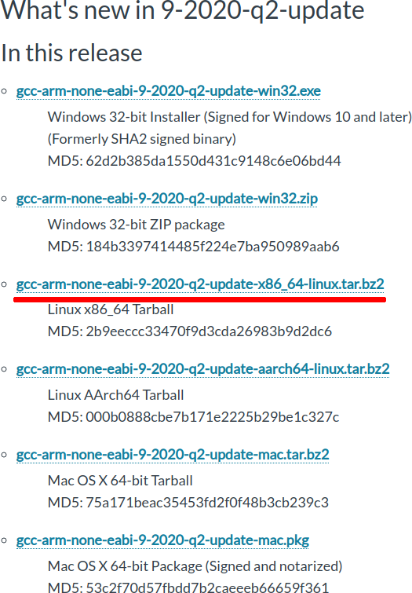
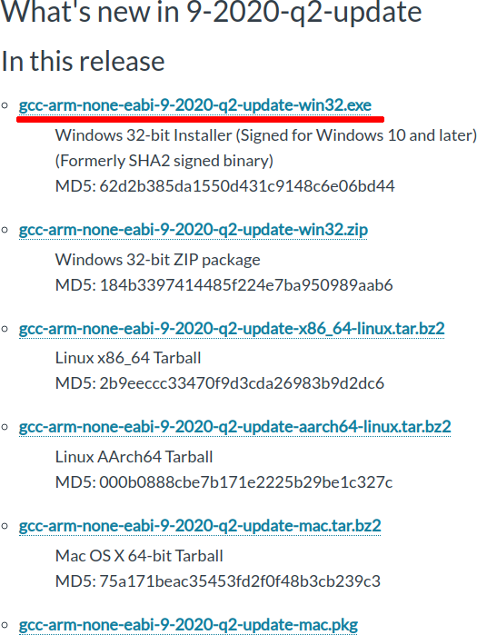

# 2- Instalar ARM GCC

## 2.1- Linux

### 2.1.1- Acesse:

[GNU Toolchain | GNU Arm Embedded Toolchain Downloads - Arm Developer](https://developer.arm.com/tools-and-software/open-source-software/developer-tools/gnu-toolchain/gnu-rm/downloads)

### 2.1.2- Faça o download da última versão do gcc-arm-none-eabi:



### 2.1.3- Defina o diretório de instalação e execute os comandos abaixo

```bash
$ DIR=<diretório de instalação, ex. /opt/arm>
$ mv gcc-arm-none-eabi*.tar.bz2 $DIR
$ cd $DIR
$ tar -xf gcc-arm-none-eabi*.tar.bz2
$ rm gcc-arm-none-eabi*.tar.bz2
$ ln -s gcc-arm-none-eabi*/ gcc-arm-none-eabi
$ echo "export GCC_ARM_NONE_EABI=${DIR}/gcc-arm-none-eabi" | sudo tee -a /etc/profile.d/99-gcc-arm-none-eabi.sh > /dev/null
$ echo 'export PATH=$PATH:$GCC_ARM_NONE_EABI/bin' | sudo tee -a /etc/profile.d/99-gcc-arm-none-eabi.sh > /dev/null
$ sudo chmod +x /etc/profile.d/99-gcc-arm-none-eabi.sh
```

### 2.1.4- Reinicie o computador e verifique se o compilador foi adicionado ao sistema:

```bash
$ arm-none-eabi-gcc --version

arm-none-eabi-gcc (GNU Arm Embedded Toolchain 9-2020-q2-update) 9.3.1 20200408 (release)
Copyright (C) 2019 Free Software Foundation, Inc.
This is free software; see the source for copying conditions.  There is NO
warranty; not even for MERCHANTABILITY or FITNESS FOR A PARTICULAR PURPOSE.
```

## 2.2- Windows

### 2.2.1- Acesse: 

[GNU Toolchain | GNU Arm Embedded Toolchain Downloads - Arm Developer](https://developer.arm.com/tools-and-software/open-source-software/developer-tools/gnu-toolchain/gnu-rm/downloads)

### 2.2.2- Faça o download da última versão do gcc-arm-none-eabi:



### 2.1.3- Execute o instalador e:

```
> Next, I Agree, Install
> MARQUE A OPÇÃO **Add path to environment variable**
> Finish
```