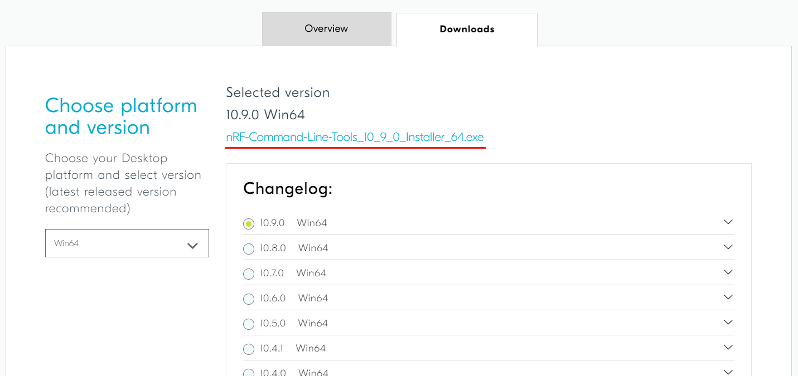

# 3- Instalar nRF Command Line Tools

## 3.1- Linux

### 3.1.1- Faça o download da última versão para linux através do link (aba download): 

[nRF Command Line Tools - Downloads](https://www.nordicsemi.com/Software-and-tools/Development-Tools/nRF-Command-Line-Tools/Download)

### 3.1.2- Execute os seguintes comandos na pasta onde o download foi realizado:

```bash
$ # Extrai o arquivo
$ tar -xf nRF-Command-Line-Tools_*.tar.gz
$ # Instala
$ sudo dpkg -i nRF-Command-Line-Tools_*.deb
$ # Testa (deve aparecer uma lista com o valor dos registradores)
$ nrfjprog --readregs
```

## 3.2- Windows

### 3.2.1- Faça o download da última versão para linux através do link (aba download): 

[nRF Command Line Tools - Downloads](https://www.nordicsemi.com/Software-and-tools/Development-Tools/nRF-Command-Line-Tools/Download)



### 3.2.2- Execute o arquivo exe e:

```
> I Agree, Install, I Accept, Install, Finish, Close
```

### 3.2.3- Abra o PowerShell e verifique se a instalação foi bem sucedida:

```powershell
$ # Testa (deve aparecer uma lista com o valor dos registradores)
$ nrfjprog --readregs
```