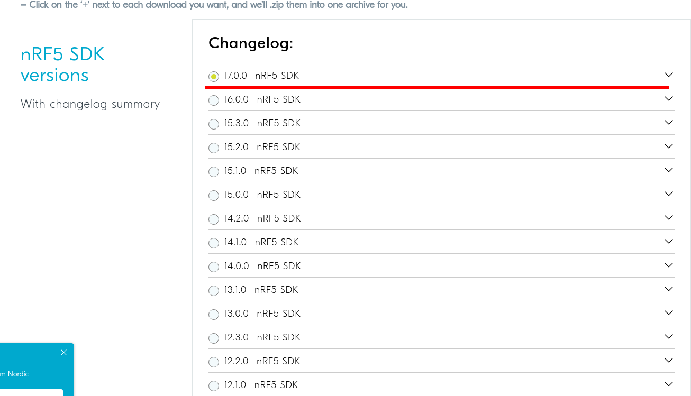
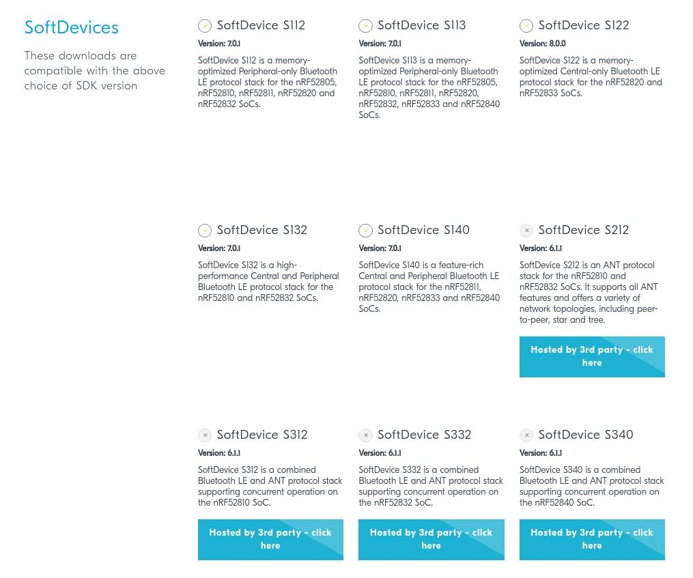
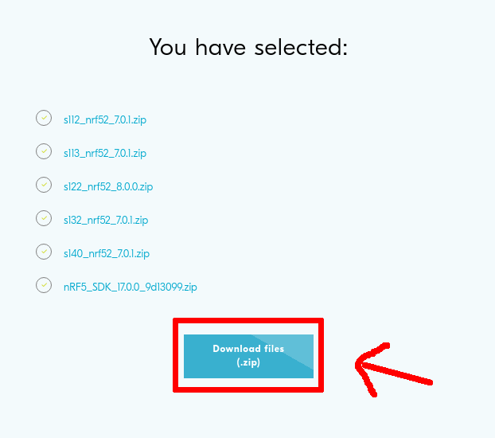
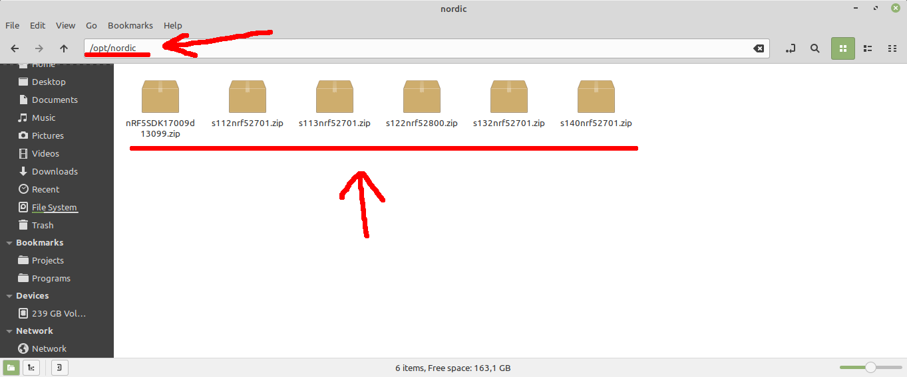
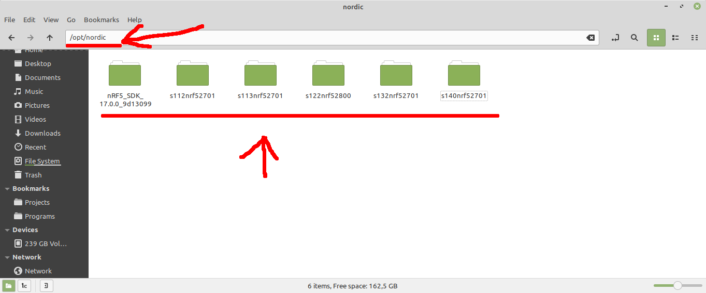
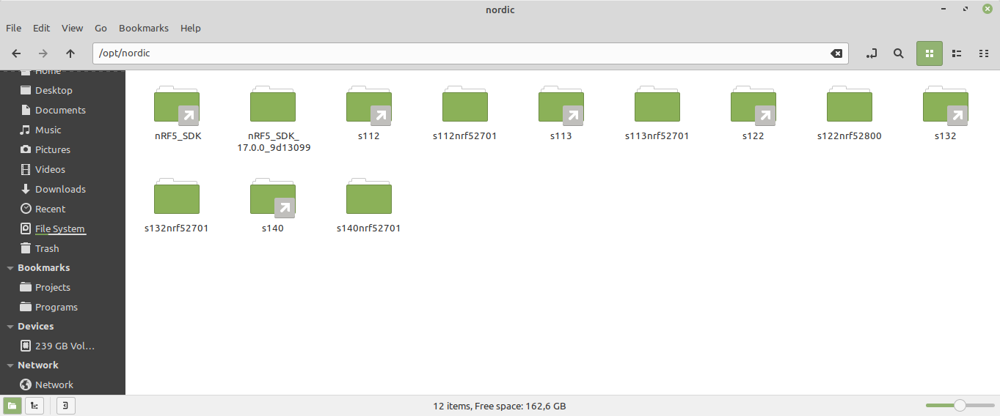
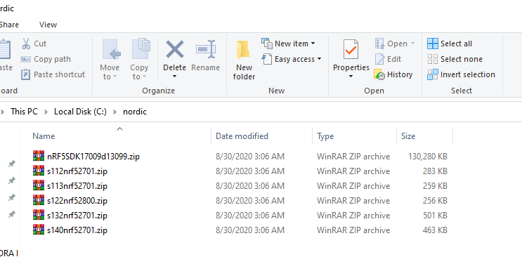
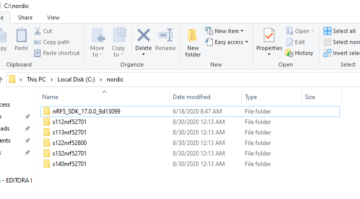
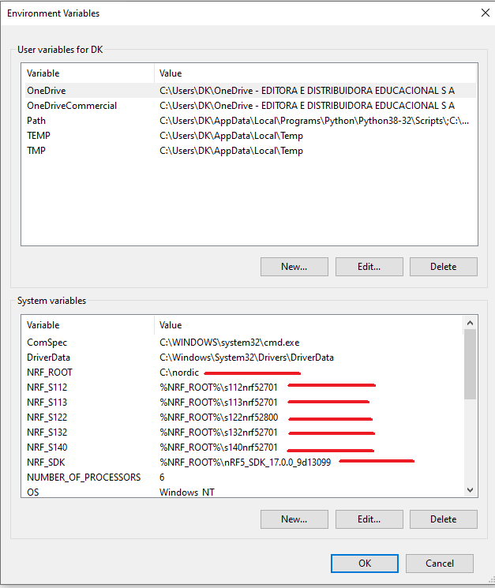

# 4- Instalar nRF5 SDK e SoftDevices

## 4.1- Linux

### 4.1.1- Acesse: 

[nRF5 SDK](https://www.nordicsemi.com/Software-and-tools/Software/nRF5-SDK/Download#infotabs)

### 4.1.2- Selecione a versão desejada do SDK:



### 4.1.3- Selecione as SoftDevices desejadas (se necessário):



### 4.1.4- Realize o download dos arquivos:



### 4.1.5- Extraia o arquivo baixado na pasta de destino do SDK (/opt/nordic ou outro local):



### 4.1.6- Descompacte os arquivos zip no diretório de destino:



### 4.1.7- Crie os links simbólicos com os comandos abaixo de acordo com as SoftDevices selecionadas:

```bash
$ # Link para o SDK
$ ln -s nRF5_SDK* nRF5_SDK

$ #  Link para as SoftDevices (utilizar de acordo com as SoftDevices baixadas)
$ ln -s s112nrf* s112
$ ln -s s113nrf* s113
$ ln -s s122nrf* s122
$ ln -s s132nrf* s132
$ ln -s s140nrf* s140
```



### 4.1.8- Adicionar os caminhos as variáveis de ambiente:

```bash
$ DIR=/opt/nordic
$ echo "export NRF_ROOT=${DIR}" | sudo tee -a /etc/profile.d/99-nordic.sh > /dev/null
$ echo 'export NRF_SDK=${NRF_ROOT}/nRF5_SDK' | sudo tee -a /etc/profile.d/99-nordic.sh > /dev/null

$ #  Variáveis para as SoftDevices (utilizar de acordo com as SoftDevices baixadas)
$ echo 'export NRF_S112=${NRF_ROOT}/s112' | sudo tee -a /etc/profile.d/99-nordic.sh > /dev/null
$ echo 'export NRF_S113=${NRF_ROOT}/s113' | sudo tee -a /etc/profile.d/99-nordic.sh > /dev/null
$ echo 'export NRF_S122=${NRF_ROOT}/s122' | sudo tee -a /etc/profile.d/99-nordic.sh > /dev/null
$ echo 'export NRF_S132=${NRF_ROOT}/s132' | sudo tee -a /etc/profile.d/99-nordic.sh > /dev/null
$ echo 'export NRF_S140=${NRF_ROOT}/s140' | sudo tee -a /etc/profile.d/99-nordic.sh > /dev/null

$ sudo chmod +x /etc/profile.d/99-nordic.sh
```

### 4.1.9- Reinicie o computador para aplicar as alterações. 

## 4.2- Windows

### 4.2.1- Acesse: 

[nRF5 SDK](https://www.nordicsemi.com/Software-and-tools/Software/nRF5-SDK/Download#infotabs)

### 4.2.2- Selecione a versão desejada do SDK:


### 4.2.3- Selecione as SoftDevices desejadas (se necessário):


### 4.2.4- Realize o download dos arquivos:


### 4.2.5- Crie o diretório C:/nordic.

### 4.2.6- Extraia o conteúdo do arquivo baixado para a pasta C:/nordic:



### 4.2.7- Extraia o conteúdo do SDK e das SoftDevices na pasta C:/nordic:



### 4.2.8- Adicione as pastas a variáveis do sistema, com o nome da variável de acordo com a imagem abaixo:

