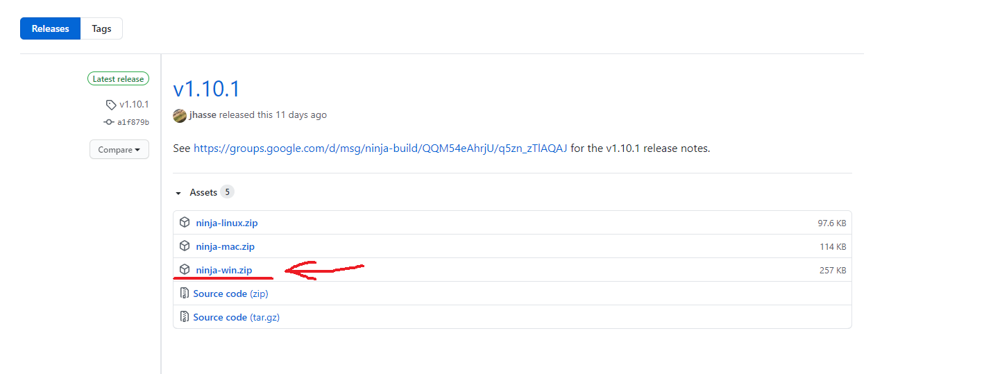

# 5- Instalar CMake

## 5.1- Linux

### 5.1.1- Seguir as instruções em:

[Installing CMake](https://cmake.org/install/)

### 5.1.2- Adicionar cmake a variável de ambiente PATH.

## 5.2- Windows

### 5.2.1- Seguir as instruções em:

[Installing CMake](https://cmake.org/install/)

### 5.2.2- Adicionar cmake a variável de ambiente PATH:

### 5.2.3- Acesse o link abaixo e faça o download da ultima versão da ferramenta "ninja":

[Ninja - Releases](https://github.com/ninja-build/ninja/releases)

### 5.2.4- Descompacte o arquivo na pasta C:/ninja:

### 5.2.5- Adicione "ninja" a variável de ambiente Path:

